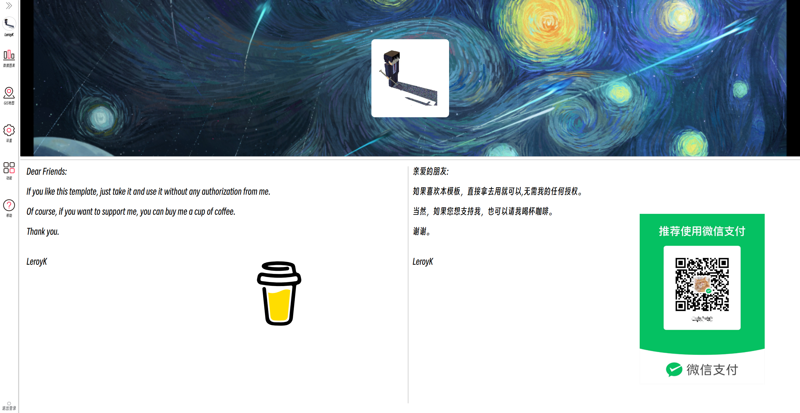

# AdminPanel
**Write a template randomly and relearn the knowledge of vue.**

username & password:  **admin**

❗❗❗❗❗❗❗❗❗❗

**SPA application released on github, there will be a lot of bugs, it is recommended to clone directly**

```
> git clone git@github.com:LeroyK111/AdminPanel.git
```
```
> cd AdminPanel
```
```
> npm run dev
```

❗❗❗❗❗❗❗❗❗❗

## Login page show


## Home page show

I won't write the responsive layout of each page.


